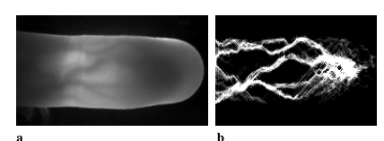

# RLT_FingerVein

This repository is a **python** implementation of RLT ([DOI](https://dl.acm.org/doi/10.5555/1522515.1522524)):

> Feature extraction of finger-vein patterns based on repeated line tracking and its application to personal identification



### Files in the folder

- ```
  data/
  ```
  - origin/
    - sample.bmp
  - result/
    - result.bmp
- `code/`: implementations of RLT

### Required packages

The code has been tested running under Python 3.6, with the following packages installed (along with their dependencies):

- numpy >= 1.14.5
- scipy >= 1.5.4
- matplotlib >= 3.3.0

### Running the code

```
$ cd code
$ python RLT.py
```
